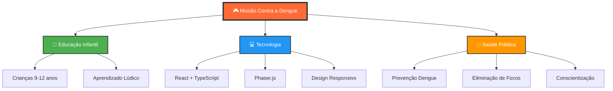
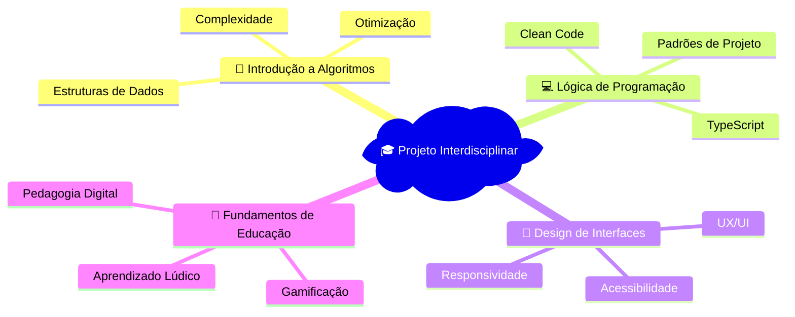

# 🦟 Missão Contra a Dengue

<div align="center">


<p>
  
  
  
</p>

<p>
  
  
  
  
</p>

</div>

---

<div align="center">

### 🎮 Um jogo educativo revolucionário que transforma aprendizado em diversão!

*Desenvolvido para ensinar crianças sobre prevenção da dengue através de uma experiência interativa inesquecível*

</div>

---

## 📊 Status do Projeto

<div align="center">

| Funcionalidade | Status | Progresso |
|---|---|---|
| 🎮 **Core Game Engine** | ✅ Completo |  |
| 🏃‍♂️ **Sistema de Movimento** | ✅ Completo |  |
| 🦟 **IA dos Mosquitos** | ✅ Completo |  |
| 💨 **Sistema de Spray** | ✅ Completo |  |
| 🎯 **Sistema de Pontuação** | ✅ Completo |  |
| 🔊 **Efeitos Sonoros** | 🔄 Em Desenvolvimento |  |
| 📱 **Design Responsivo** | ✅ Completo |  |
| 🏆 **Sistema de Rankings** | 🔄 Em Desenvolvimento |  |

</div>

---

## 🎯 Sobre o Projeto

<div align="center">



</div>

### 🏆 Objetivos do Projeto

<table>
<tr>
<td width="50%">

**🎯 Objetivo Geral**
> Desenvolver um jogo educacional online que ensine práticas de combate à dengue de forma interativa e envolvente

</td>
<td width="50%">

**🎪 Objetivos Específicos**
- 🧠 Promover conscientização sobre dengue
- 🔧 Ensinar eliminação de focos
- ⚡ Estimular raciocínio rápido
- 💻 Aplicar conhecimentos técnicos

</td>
</tr>
</table>

---

## 🎮 Mecânicas do Jogo

<details>
<summary>🕹️ <strong>Controles & Comandos</strong></summary>

| Tecla | Ação | Efeito |
|-------|------|--------|
| ⬆️ | Mover para cima | Personagem se move verticalmente |
| ⬇️ | Mover para baixo | Personagem se move verticalmente |
| ⬅️ | Mover para esquerda | Personagem se move horizontalmente |
| ➡️ | Mover para direita | Personagem se move horizontalmente |
| 🚀 **ESPAÇO** | **Spray Repelente** | **Elimina mosquitos em área** |

</details>

<details>
<summary>🎯 <strong>Sistema de Pontuação</strong></summary>

```
🏺 Foco de Dengue Eliminado = +1 ponto
🦟 Mosquito Eliminado = +2 pontos
💔 Picada de Mosquito = -1 vida
⏰ Tempo Limite = 3 minutos
❤️ Vidas Iniciais = 5
```

**Multiplicadores Especiais:**
- 🔥 **Combo x2**: Eliminar 3+ mosquitos seguidos
- ⚡ **Speed Bonus**: Eliminar foco em <5 segundos
- 🏆 **Perfect Round**: Completar sem perder vida

</details>

<details>
<summary>📈 <strong>Progressão de Dificuldade</strong></summary>

| Fase | Focos | Mosquitos | Velocidade | Tempo |
|------|-------|-----------|------------|-------|
| 🥉 **Iniciante** | 5-8 | 3-5 | Lenta | 3:00 |
| 🥈 **Intermediário** | 8-12 | 5-8 | Média | 2:30 |
| 🥇 **Avançado** | 12-15 | 8-12 | Rápida | 2:00 |
| 💎 **Expert** | 15+ | 12+ | Muito Rápida | 1:30 |

</details>

---

## 🛠️ Stack Tecnológica

<div align="center">

### Frontend Architecture
```
┌─────────────────────────────────────┐
│             React 18                │
│  ┌─────────────┐ ┌─────────────────┐│
│  │ TypeScript  │ │   Vite Build    ││
│  └─────────────┘ └─────────────────┘│
└─────────────────────────────────────┘
┌─────────────────────────────────────┐
│            Phaser.js 3              │
│  ┌─────────────┐ ┌─────────────────┐│
│  │   Scenes    │ │    Entities     ││
│  └─────────────┘ └─────────────────┘│
└─────────────────────────────────────┘
┌─────────────────────────────────────┐
│        Game Components              │
│  ┌─────────────┐ ┌─────────────────┐│
│  │ Context API │ │   CSS Modules   ││
│  └─────────────┘ └─────────────────┘│
└─────────────────────────────────────┘
```

</div>

### 🔧 Tecnologias Detalhadas

<table>
<tr>
<td width="33%">

**🎨 Frontend**
-  **React 18**
-  **TypeScript**
-  **Vite**
-  **CSS3 Modules**

</td>
<td width="33%">

**🎮 Game Engine**
-  **Phaser.js 3**
- 🎭 **Scene Management**
- 🏃‍♂️ **Physics Engine**
- 🔊 **Audio System**

</td>
<td width="33%">

**🔨 Dev Tools**
-  **Node.js 16+**
-  **NPM**
-  **Git**
-  **ESLint**

</td>
</tr>
</table>

---

## 📁 Arquitetura do Projeto

<details>
<summary>🗂️ <strong>Estrutura de Arquivos</strong></summary>

```
📦 missao-contra-dengue/
├── 📁 public/
│   ├── 🖼️ favicon.svg
│   └── 📄 index.html
├── 📁 src/
│   ├── 📁 components/          # 🧩 React Components
│   │   ├── 🏠 MainMenu.tsx
│   │   ├── 📖 Instructions.tsx
│   │   ├── 🎮 Game.tsx
│   │   └── 🏁 GameOver.tsx
│   ├── 📁 context/             # 🔄 State Management
│   │   └── 🎯 GameContext.tsx
│   ├── 📁 game/                # 🎮 Phaser Game Logic
│   │   ├── 📁 scenes/          # 🎭 Game Scenes
│   │   │   ├── 🚀 BootScene.ts
│   │   │   ├── 🎮 MainScene.ts
│   │   │   └── 🎨 UIScene.ts
│   │   └── 📁 entities/        # 👾 Game Objects
│   │       ├── 🏃‍♂️ Player.ts
│   │       ├── 🦟 Mosquito.ts
│   │       └── 🏺 BreedingSite.ts
│   ├── 📁 assets/              # 🎵 Media Files
│   │   ├── 🎵 sounds/
│   │   └── 🖼️ images/
│   ├── 📁 styles/              # 🎨 Stylesheets
│   └── 🚀 App.tsx              # 🎯 Main Component
├── 📄 package.json
├── 📄 tsconfig.json
├── 📄 vite.config.ts
└── 📖 README.md
```

</details>

---

## 🚀 Começando

### ⚡ Instalação Rápida

<details>
<summary>💻 <strong>Pré-requisitos</strong></summary>

```bash
# Verificar versão do Node.js (necessário 16+)
node --version

# Verificar versão do npm
npm --version

# Verificar versão do git
git --version
```

**Requisitos Mínimos:**
- 🟢 Node.js v16.0.0+
- 🔧 NPM v7.0.0+
- 📦 Git v2.25.0+
- 💾 500MB de espaço livre

</details>

### 🔥 Setup em 3 Passos

```bash
# 1️⃣ Clone o repositório
git clone https://github.com/seu-usuario/missao-contra-dengue.git
cd missao-contra-dengue

# 2️⃣ Instale as dependências
npm install

# 3️⃣ Execute o projeto
npm run dev
```

<div align="center">

🎉 **Pronto!** Acesse [http://localhost:5173](http://localhost:5173) e comece a jogar!

</div>

### 🛠️ Scripts Disponíveis

| Script | Comando | Descrição |
|--------|---------|-----------|
| 🚀 **Dev** | `npm run dev` | Inicia servidor de desenvolvimento |
| 🏗️ **Build** | `npm run build` | Gera build de produção |
| 👀 **Preview** | `npm run preview` | Visualiza build de produção |
| 🧹 **Lint** | `npm run lint` | Executa linting do código |
| 🧪 **Test** | `npm run test` | Executa testes unitários |

---

## 🎨 Design System

<details>
<summary>🎨 <strong>Paleta de Cores</strong></summary>

| Cor | Hex | Preview | Uso |
|-----|-----|---------|-----|
| 🔥 **Primary** | `#FF6B35` |  | Elementos principais |
| 💧 **Secondary** | `#2196F3` |  | Água e focos |
| 🌱 **Success** | `#4CAF50` |  | Feedback positivo |
| ⚠️ **Warning** | `#FF9800` |  | Alertas |
| ❌ **Danger** | `#F44336` |  | Mosquitos e perigo |
| 🌙 **Background** | `#1A1A2E` |  | Fundo principal |

</details>

<details>
<summary>🎪 <strong>Componentes Visuais</strong></summary>

**Personagens:**
- 🏃‍♂️ Agente de Saúde (Protagonista)
- 🦟 Mosquito Aedes Aegypti
- 🏺 Focos de Dengue (Vasos, Pneus, etc.)

**Elementos UI:**
- ❤️ Barra de Vida Animada
- 🎯 Contador de Pontos
- ⏰ Timer com Urgência Visual
- 💨 Efeito de Spray Partículas

**Animações:**
- 🏃‍♂️ Movimentação suave do personagem
- 🦟 Voo realista dos mosquitos
- ✨ Efeitos de eliminação
- 📊 Transições de tela

</details>

---

## 🏆 Funcionalidades Implementadas

<div align="center">

### 🎮 Core Gameplay
| Feature | Status | Descrição |
|---------|--------|-----------|
| 🏃‍♂️ **Player Movement** | ✅ | Sistema completo de movimentação |
| 🦟 **Mosquito AI** | ✅ | IA básica com pathfinding |
| 💨 **Spray System** | ✅ | Mecânica de spray com área de efeito |
| 🏺 **Breeding Sites** | ✅ | Geração e coleta de focos |
| ❤️ **Health System** | ✅ | Sistema de vida com feedback visual |
| 🎯 **Scoring** | ✅ | Pontuação com multiplicadores |

### 🎨 Interface & UX
| Feature | Status | Descrição |
|---------|--------|-----------|
| 🏠 **Main Menu** | ✅ | Menu principal animado |
| 📖 **Instructions** | ✅ | Tutorial interativo |
| 🎮 **Game UI** | ✅ | HUD completa em tempo real |
| 🏁 **Game Over** | ✅ | Tela de fim com estatísticas |
| 📱 **Responsive** | ✅ | Design adaptativo |
| 🔊 **Audio** | ✅ | Efeitos sonoros imersivos |

### 🎓 Educacional
| Feature | Status | Descrição |
|---------|--------|-----------|
| 📚 **Content Integration** | ✅ | Conteúdo educativo integrado |
| 💡 **Tips System** | ✅ | Dicas de prevenção |
| 🏆 **Achievement** | 🔄 | Sistema de conquistas |
| 📊 **Progress Tracking** | 🔄 | Acompanhamento de progresso |

</div>

---

## 🎓 Contexto Acadêmico

<div align="center">

### 📚 Projeto Interdisciplinar II



</div>

**👨‍🎓 Desenvolvedor:** João Vitor Galimberti Contarato  
**🏫 Instituição:** Faculdade UCL

### 🎯 Competências Desenvolvidas

<table>
<tr>
<td width="50%">

**💻 Técnicas**
- ✅ Programação em TypeScript
- ✅ Desenvolvimento React
- ✅ Game Development
- ✅ Arquitetura de Software
- ✅ Versionamento Git
- ✅ Metodologias Ágeis

</td>
<td width="50%">

**🧠 Transversais**
- ✅ Resolução de Problemas
- ✅ Pensamento Computacional
- ✅ Trabalho Interdisciplinar
- ✅ Comunicação Técnica
- ✅ Gestão de Projetos
- ✅ Inovação Educacional

</td>
</tr>
</table>

---

## 🤝 Contribuição

<div align="center">

### 🌟 Seja Parte desta Missão!

Contribuições fazem a comunidade open source um lugar incrível para aprender, inspirar e criar.  
**Qualquer contribuição que você fizer será muito apreciada!**

</div>

### 🔄 Como Contribuir

<details>
<summary>🚀 <strong>Guia Rápido de Contribuição</strong></summary>

1. **🍴 Fork o Projeto**
   ```bash
   # Clique no botão "Fork" no GitHub
   ```

2. **🌿 Crie sua Branch**
   ```bash
   git checkout -b feature/MinhaFeatureIncrivel
   ```

3. **💾 Commit suas Mudanças**
   ```bash
   git commit -m '✨ Adiciona MinhaFeatureIncrivel'
   ```

4. **📤 Push para a Branch**
   ```bash
   git push origin feature/MinhaFeatureIncrivel
   ```

5. **🔍 Abra um Pull Request**
   - Acesse o GitHub
   - Clique em "New Pull Request"
   - Descreva suas mudanças

</details>

### 🎯 Áreas para Contribuição

<table>
<tr>
<td width="33%">

**🐛 Bug Fixes**
- 🔍 Encontrar e corrigir bugs
- 🧪 Adicionar testes
- 📝 Melhorar documentação
- ⚡ Otimizar performance

</td>
<td width="33%">

**✨ Novas Features**
- 🏆 Sistema de achievements
- 🌐 Modo multiplayer
- 📊 Analytics do jogo
- 🎨 Novos personagens e cenários

</td>
<td width="33%">

**📚 Educacional**
- 📖 Mais conteúdo educativo
- 🌍 Traduções
- 👨‍🏫 Material didático
- 🎮 Novas mecânicas

</td>
</tr>
</table>

### 🤝 Vamos Conversar!

<p>
  <a href="mailto:seu-email@exemplo.com">
    
  </a>
  <a href="https://linkedin.com/in/seu-perfil">
    
  </a>
  <a href="https://github.com/seu-usuario">
    
  </a>
</p>

**📧 Email:** [seu-email@exemplo.com](mailto:joaogalimberti@gmail.com)  
**🔗 LinkedIn:** [João Vitor Galimberti Contarato](https://linkedin.com/in/joaogalimberti)  
**🐙 GitHub:** [@seu-usuario](https://github.com/joaogalimberti)  
**🌐 Projeto:** [Missão Contra a Dengue](https://github.com/joaogalimberti/dengue-mission)

</div>

### 🆘 Suporte

Encontrou um problema? Precisa de ajuda?

<table>
<tr>
<td width="33%">

**🐛 Bug Report**
[Criar Issue](https://github.com/joaogalimberti/dengue-mission/issues/new?template=bug_report.md)

</td>
<td width="33%">

**💡 Feature Request**
[Sugerir Feature](https://github.com/joaogalimberti/dengue-mission/issues/new?template=feature_request.md)

</td>
<td width="33%">

**❓ Dúvidas**
[Abrir Discussion](https://github.com/joaogalimberti/dengue-mission/discussions)

</td>
</tr>
</table>

---

<div align="center">

## 🏆 Estatísticas do Projeto


---

### 🌟 Apoie o Projeto

Se este projeto te ajudou, considere dar uma ⭐!  
Isso ajuda mais pessoas a descobrirem este trabalho.

<p>
  <a href="https://github.com/seu-usuario/missao-contra-dengue">
    
  </a>
  <a href="https://github.com/seu-usuario/missao-contra-dengue/fork">
    
  </a>
</p>

---

<h3>🦟 Combatendo a dengue através da educação e tecnologia! 🎮</h3>

<p>
  
</p>

</div>
